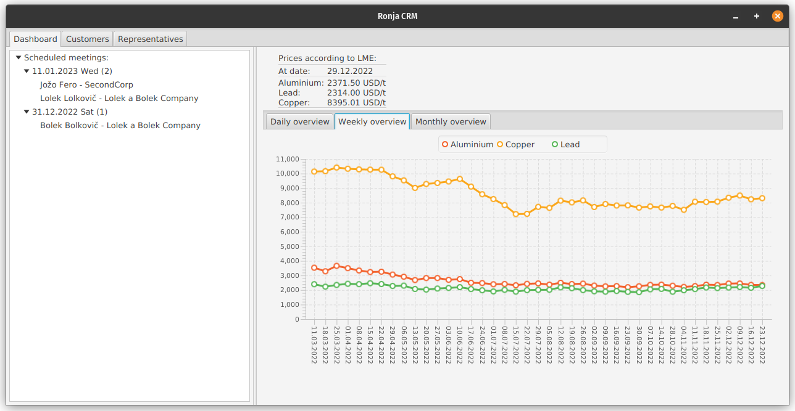
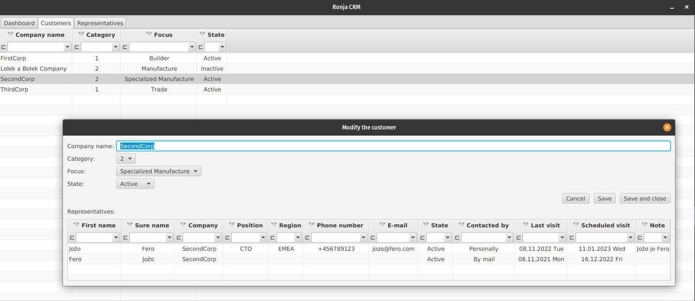
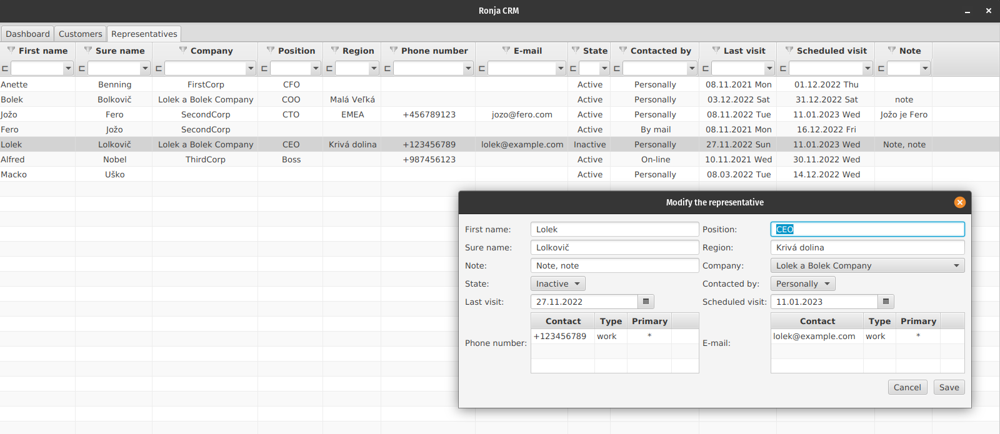

  

  

## Ronja CRM client
Application is desktop client for communication with respective middleware CRM server, which provides connection to the database.  
Client is implemented in JavaFX and Spring Boot.  
In case you would like to run this client application, it's necessary first start `REST API Ronja Server` via [docker-compose](/docker-compose.yml).
For testing purpose is the application preconfigured to expect CRM server on localhost:8087.

### Installation
The preferred way of installation is to build and run the application as a fat jar on any hosting OS with Java 20 installed.  
When a hosting system for client doesn't provide JRE in version 20, it's recommended to bundle the respective fat jar with its own JRE of correct Java version.  

It's also recommended to put the application's related properties file into the same folder as the application's fat jar.  
The properties file is intended, among other things, to set GUI language. User can choose between Slovak and English language.  
User can also change URL for communication with `REST API Ronja Server` to connect for example server instance deployed on cloud.

### Usage
Application start takes few seconds, due to prerequisite connection establishing to `REST API Ronja Server`.  
During connection initialization application shows splash screen.
After successful start, application shows following tabs:

#### Dashboard
Provides overview about:
- scheduled meetings with customer representatives
- current metal prices for copper, aluminium and lead according to London metal exchange
- metal prices progress timeline (on daily, weekly and monthly basis)

#### Customers
Allows user to handle customers records:
- shows list of customers
- provides advanced filtering over list of customers
- adds, deletes or changes particular customer
- handles representatives related to respective customer

#### Representatives
Allows user to handle representatives records:
- shows list of representatives
- provides advanced filtering over list of representatives
- adds, deletes or changes particular representative

